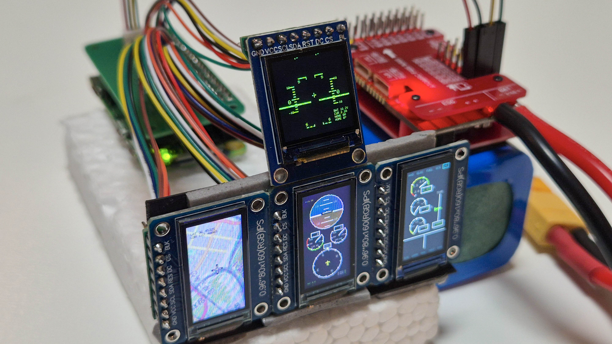
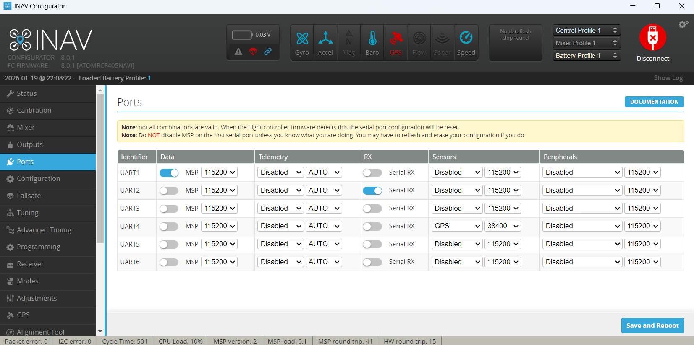

# OpenCockpit
FPV cockpit display with Raspberry Pi

Full description will be created after the project is completed

---

## Install Raspberry Pi OS
### Option 1  : Install preset OS
_Installable on 16GB microSD_
 1. Download and install [Raspberry Pi imager](https://www.raspberrypi.com/software/).
 2. Download [OS img file](https://naver.me/5sGocZzT) and extract zip file.
 3. Run Raspberry Pi imager, Connect 16GB MicroSD to PC.
 4. Select [No filtering] - [Use Custom] - [OpenCockpit-16GB-yymmdd.img] - [WRITE] in Raspberry Pi imager.
   
### Option 2 : Make new OpenCockpit from basic Raspberry Pi OS
_To use 32GB or another microSD, make new OpenCockpit from basic Raspberry Pi OS_
 1. Follow guide
    - [English](https://vudev.notion.site/OpenCockpit-setup-English-2ec6ea6262ea80e7a53cd84920953c4e?source=copy_link).
    - [한국어](https://vudev.notion.site/OpenCockpit-2ec6ea6262ea81c1a555c2e47eb1c878?source=copy_link).

---

## Set INAV port

After install INAV on FC, set UART1 as MSP 115200 in ports tab, and connect uart1 to FC connector on main PCB

---

## Build hardwares
comming soon

---

## Customize softwares
comming soon
