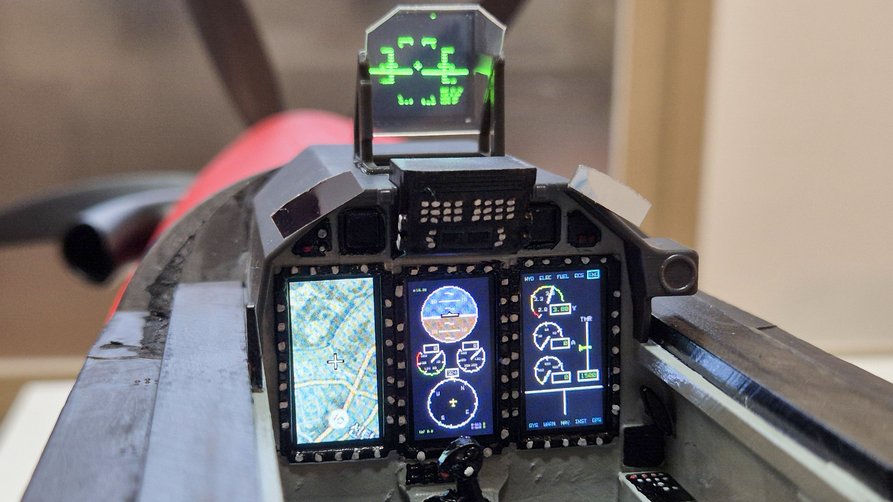

# OpenCockpit

OpenCockpit is an open-source FPV cockpit display that uses a Raspberry Pi.
It consists of working displays such as a HUD, map, and MFD, and it receives data from the flight controller(FC) to show live flight data in real time.

---

## Full Build Tutuorial
  - [English](https://vudev.notion.site/OpenCockpit-Build-Tutorial-3566ea6262ea80a49489f02d480d7f26?source=copy_link)
  - [한국어](https://vudev.notion.site/OpenCockpit-3566ea6262ea80b49948cab48c1eeefa?source=copy_link)
